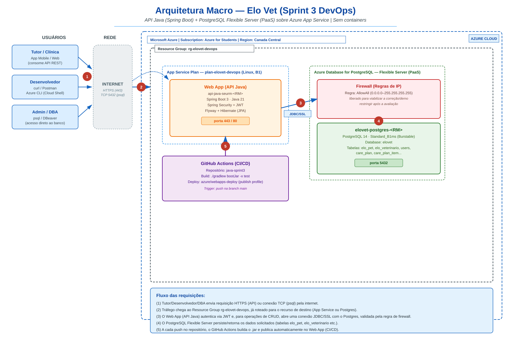

# Elo-Vet-DevOps

> Infraestrutura como código (Azure CLI) do projeto **Elo Vet** — provisiona um **Azure App Service** (API Java/Spring Boot) e um banco **PostgreSQL Flexible Server (PaaS)**, sem containers, para a disciplina de DevOps Tools & Cloud Computing.

[](https://azure.microsoft.com/)
[]()
[-336791?logo=postgresql&logoColor=white)]()
[]()
[]()
[]()

---

## 📋 Sumário

- [1. Descrição da solução](#1-descrição-da-solução)
- [2. Benefícios para o negócio](#2-benefícios-para-o-negócio)
- [3. Arquitetura macro](#3-arquitetura-macro)
- [4. Componentes da stack](#4-componentes-da-stack)
- [5. Estrutura do repositório](#5-estrutura-do-repositório)
- [6. Pré-requisitos](#6-pré-requisitos)
- [7. Como rodar — passo a passo](#7-como-rodar--passo-a-passo)
- [8. Verificação e testes (CRUD)](#8-verificação-e-testes-crud)
- [9. Variáveis de ambiente](#9-variáveis-de-ambiente)
- [10. Solução de problemas comuns](#10-solução-de-problemas-comuns)
- [11. Como derrubar a infraestrutura](#11-como-derrubar-a-infraestrutura)
- [12. Segurança](#12-segurança)
- [13. Equipe](#13-equipe)

---

## 1. Descrição da solução

O **Elo Vet** ([Challenge-2026-EloVet/java-sprint3](https://github.com/Challenge-2026-EloVet/java-sprint3)) é uma API backend em **Spring Boot** que apoia clínicas veterinárias e tutores no acompanhamento pós-consulta de pets: cadastro de **pets** e **veterinários**, autenticação com **JWT**, e um fluxo de **planos de cuidado** (checklist terapêutico com lembretes) que reduz o abandono de tratamento após a consulta.

Este repositório (`Elo-Vet-DevOps`) contém **toda a camada de infraestrutura** exigida pela entrega de Sprint 3, opção *"Serviço de Aplicativo + Banco PaaS"*:

- **Scripts em Azure CLI** para provisionar o Resource Group, o App Service Plan, o Web App (Java) e o banco PostgreSQL Flexible Server — nenhum recurso é criado pelo Portal, só via CLI.
- **`script_bd.sql`** com o DDL real das tabelas usadas pela aplicação (`elo_pet`, `elo_veterinario` e demais tabelas do domínio).
- **Workflow de CI/CD pronto** (GitHub Actions) para build + deploy automático a cada push.
- **Documentação completa** para reproduzir a solução **do zero** — desde a criação do Resource Group até o primeiro teste de CRUD.

> **Objetivo pedagógico:** demonstrar a criação de infraestrutura em nuvem 100% via linha de comando (Azure CLI), com um App Service Java conectado a um banco de dados gerenciado (PaaS), sem uso de containers — e com um pipeline de CI/CD funcional ligando o GitHub ao Azure.

---

## 2. Benefícios para o negócio

- **Handoff automatizado** entre veterinário e tutor: reduz retrabalho manual e falhas de comunicação pós-consulta.
- **Adesão ao tratamento**: o checklist com lembretes aumenta a chance do tutor seguir o plano de cuidados corretamente.
- **Escalabilidade sem operação de infraestrutura**: o App Service e o banco PaaS eliminam a necessidade de gerenciar servidores, aplicar patch de SO ou fazer backup manual do banco.
- **Custo previsível**: plano de serviço e SKU do banco dimensionados para o cenário de demonstração/avaliação (facilmente escaláveis para produção).

---

## 3. Arquitetura macro



### Fluxo de uma requisição (legenda do diagrama)

1. **Usuário externo** (tutor/clínica via app, desenvolvedor com curl/Postman, ou DBA com `psql`/DBeaver) envia uma requisição HTTPS (API) ou uma conexão TCP (banco) pela internet.
2. O tráfego chega ao **Resource Group** `rg-elovet-devops`, já roteado para o recurso de destino: o **App Service** (porta 443) ou o **PostgreSQL** (porta 5432).
3. O **Web App** (`api-java-seurm-<RM>`) autentica a requisição via **JWT** e, quando precisa ler/gravar dados, abre uma conexão **JDBC/SSL** com o Postgres — validada pela **regra de firewall** do servidor.
4. O **PostgreSQL Flexible Server** (`elovet-postgres-<RM>`) persiste ou retorna os dados solicitados nas tabelas `elo_pet`, `elo_veterinario`, entre outras.
5. A cada `push` no repositório `java-sprint3`, o **GitHub Actions** builda o `.jar` (Gradle) e publica automaticamente no Web App — CI/CD completo, sem passo manual.

---

## 4. Componentes da stack

### 4.1 Infraestrutura (Azure)

| Recurso                     | Descrição                                                          |
| ---------------------------- | ------------------------------------------------------------------- |
| Assinatura                  | Azure for Students                                                  |
| Região                      | Canada Central                                                      |
| Resource Group              | `rg-elovet-devops`                                                  |
| App Service Plan            | `plan-elovet-devops` — Linux, SKU `B1` (Basic)                       |
| Web App                     | `api-java-seurm-<RM>` — runtime `JAVA:21-java21`                     |
| PostgreSQL Flexible Server  | `elovet-postgres-<RM>` — `Standard_B1ms` (Burstable), versão 14      |
| Database                    | `elovet`                                                             |

### 4.2 Aplicação (API Java)

| Item              | Descrição                                                         |
| ------------------ | ------------------------------------------------------------------ |
| Framework          | Spring Boot 3, Java 21                                              |
| Build              | Gradle (`./gradlew bootJar -x test`)                                |
| Persistência       | Spring Data JPA + Hibernate, migrações via Flyway                   |
| Segurança          | Spring Security + JWT (`API_SECURITY_TOKEN_SECRET`)                 |
| CI/CD              | GitHub Actions → `azure/webapps-deploy` (publish profile)           |

### 4.3 Banco de dados

- **Database:** `elovet`
- **Tabelas do CORE (usadas na demonstração de CRUD):** `elo_pet`, `elo_veterinario`
- **Demais tabelas do domínio:** `users`, `care_plan`, `care_plan_item`, `notification`, `follow_up_log`
- DDL completo e comentado em [`script_bd.sql`](./script_bd.sql)

---

## 5. Estrutura do repositório

```
Elo-Vet-DevOps/
├── README.md                          # este arquivo
├── script_bd.sql                      # DDL das tabelas do banco
├── arquitetura-elovet.png             # diagrama de arquitetura macro (fonte: arquitetura-elovet.svg)
├── github-actions/
│   └── deploy-devops-sprint3.yml      # workflow pronto e testado (usado de fato no java-sprint3)
└── scripts/
    ├── criacao-Resorce-Group/
    │   └── Configuracao-iniciais.sh    # variáveis compartilhadas + cria o Resource Group
    ├── AppsAzure/
    │   ├── 02-create-postgres.sh       # cria o banco PaaS (servidor + database + firewall)
    │   └── 03-create-webapp.sh         # cria o App Service e conecta no banco
    ├── GitHubAcitions.sh                # copia o workflow pronto + cria o Secret do publish profile
    └── RemovendoGroups.sh               # remove todos os recursos ao final
```

> **Repositório complementar (código-fonte da API):**
> [Challenge-2026-EloVet/java-sprint3](https://github.com/Challenge-2026-EloVet/java-sprint3) — clonado **fora** desta pasta (ex.: `~/java-sprint3`), nunca dentro de `Elo-Vet-DevOps`.

---

## 6. Pré-requisitos

- [Azure CLI](https://learn.microsoft.com/cli/azure/install-azure-cli) autenticado (`az login`) na assinatura correta.
- [GitHub CLI](https://cli.github.com/) autenticado (`gh auth login`) — necessário só para o CI/CD (`GitHubAcitions.sh`).
- `git`, `openssl` e um JDK (para buildar o `.jar` com `./gradlew`).
- Permissão de owner/contributor na assinatura para criar Resource Group, App Service e PostgreSQL Flexible Server.

---

## 7. Como rodar — passo a passo

> **Tempo total estimado:** ~10–15 minutos do zero até a API respondendo.

Execute a partir do Cloud Shell (ou terminal local com Azure CLI logado), rodando **um arquivo de cada vez**, nesta ordem.

### 🚀 Passo 1 — Clonar este repositório

```bash
git clone https://github.com/Challenge-2026-EloVet/Elo-Vet-DevOps.git
cd Elo-Vet-DevOps/scripts
chmod +x criacao-Resorce-Group/*.sh AppsAzure/*.sh GitHubAcitions.sh RemovendoGroups.sh
```

### 🚀 Passo 2 — Criar o Resource Group

```bash
./criacao-Resorce-Group/Configuracao-iniciais.sh
```

Registra os providers necessários (`Microsoft.Web`, `Microsoft.DBforPostgreSQL`) e cria o Resource Group `rg-elovet-devops` na região `canadacentral`.

### 🚀 Passo 3 — Criar o banco PostgreSQL (PaaS)

```bash
./AppsAzure/02-create-postgres.sh
```

Pede o usuário/senha do administrador do banco (interativo, nunca salvo em arquivo) e cria o servidor `elovet-postgres-<RM>` + a database `elovet` + a regra de firewall.

### 🚀 Passo 4 — Criar o App Service (API Java)

```bash
./AppsAzure/03-create-webapp.sh
```

Pede o **mesmo** usuário/senha do passo anterior, cria o Plano de Serviço + o Web App (Java 21) e já configura, como *App Settings*: a conexão com o banco, a desativação do Docker Compose autodetectado pelo Spring, e um segredo JWT gerado automaticamente.

### 🚀 Passo 5 — Publicar o código (deploy)

**Opção A — CI/CD automático (GitHub Actions), 100% via CLI:**

```bash
git clone https://github.com/Challenge-2026-EloVet/java-sprint3.git ~/java-sprint3
./GitHubAcitions.sh ~/java-sprint3
```

Esse script copia o workflow pronto ([`github-actions/deploy-devops-sprint3.yml`](./github-actions/deploy-devops-sprint3.yml)) para dentro do clone e já cria o Secret `AZURE_WEBAPP_PUBLISH_PROFILE_DEVOPS` no GitHub via `gh secret set` (o valor nunca aparece na tela). Depois é só commitar e subir:

```bash
cd ~/java-sprint3
git add .github/workflows/deploy-devops-sprint3.yml
git commit -m "ci: adiciona deploy automático para api-java-seurm-<RM>"
git push
```

> ⚠️ **Só rode isso depois que a infraestrutura estiver estável.** Toda vez que o App Service é recriado, o Azure gera credenciais de deploy novas — se isso acontecer, rode `./GitHubAcitions.sh` de novo para atualizar o Secret antes de confiar no CI/CD.

**Opção B — Deploy manual (mais simples, sem depender de Secret nenhum):**

```bash
cd ~/java-sprint3
chmod +x gradlew
./gradlew bootJar -x test

az webapp deploy \
  --resource-group rg-elovet-devops \
  --name api-java-seurm-<RM> \
  --src-path ./build/libs/elo-vet-api-0.0.1-SNAPSHOT.jar \
  --type jar
```

Ao final de qualquer uma das opções, a API está no ar em `https://api-java-seurm-<RM>.azurewebsites.net`.

---

## 8. Verificação e testes (CRUD)

As rotas de escrita exigem autenticação JWT. Primeiro registre e autentique um usuário `ADMIN`:

```bash
BASE_URL="https://api-java-seurm-<RM>.azurewebsites.net"

# 1) Registrar um usuário ADMIN
curl -X POST "$BASE_URL/auth/register" \
  -H "Content-Type: application/json" \
  -d '{"nomeUsuario":"admin1","email":"admin1@elovet.com","senha":"senhaForte123","tipoUsuario":"ADMIN"}'

# 2) Login (retorna { "token": "..." })
TOKEN=$(curl -s -X POST "$BASE_URL/auth/login" \
  -H "Content-Type: application/json" \
  -d '{"nomeUsuario":"admin1","senha":"senhaForte123"}' | jq -r .token)
```

### 8.1 CRUD de Pet

```bash
# Criar (INSERT)
curl -X POST "$BASE_URL/pet" \
  -H "Content-Type: application/json" -H "Authorization: Bearer $TOKEN" \
  -d '{"nome":"Thor","especie":"Cachorro","raca":"Golden Retriever","sexo":"M","flagCastrado":true}'

# Consultar (SELECT)
curl -H "Authorization: Bearer $TOKEN" "$BASE_URL/pet"

# Alterar (UPDATE) — troque {id} pelo id retornado na criação
curl -X PUT "$BASE_URL/pet/{id}" \
  -H "Content-Type: application/json" -H "Authorization: Bearer $TOKEN" \
  -d '{"nome":"Thor Jr","especie":"Cachorro","raca":"Golden Retriever","sexo":"M","flagCastrado":true}'

# Excluir (DELETE)
curl -X DELETE "$BASE_URL/pet/{id}" -H "Authorization: Bearer $TOKEN"
```

### 8.2 CRUD de Veterinário

```bash
curl -X POST "$BASE_URL/veterinary" \
  -H "Content-Type: application/json" -H "Authorization: Bearer $TOKEN" \
  -d '{"idUsuario":1,"nomeCompleto":"Dra. Ana Silva","cpf":"12345678901","crmv":"CRMV-1001"}'

curl -H "Authorization: Bearer $TOKEN" "$BASE_URL/veterinary"

curl -X PUT "$BASE_URL/veterinary/{id}" \
  -H "Content-Type: application/json" -H "Authorization: Bearer $TOKEN" \
  -d '{"idUsuario":1,"nomeCompleto":"Dra. Ana S.","cpf":"12345678901","crmv":"CRMV-1001"}'

curl -X DELETE "$BASE_URL/veterinary/{id}" -H "Authorization: Bearer $TOKEN"
```

### 8.3 Validar direto no banco (SELECT)

```bash
psql "host=elovet-postgres-<RM>.postgres.database.azure.com port=5432 \
  dbname=elovet user=<usuario_admin> sslmode=require" \
  -c "SELECT * FROM elo_pet;" -c "SELECT * FROM elo_veterinario;"
```

Cada operação feita pela API deve refletir imediatamente nesse `SELECT` — é essa integração total entre App e Banco que a entrega exige evidenciar no vídeo.

---

## 9. Variáveis de ambiente

Todas as variáveis são configuradas como **App Settings** do Web App pelo próprio `03-create-webapp.sh` — nenhuma fica hardcoded no código-fonte ou nos scripts.

| Variável                          | Descrição                                                                 |
| ---------------------------------- | --------------------------------------------------------------------------- |
| `SPRING_DATASOURCE_URL`            | JDBC URL do Postgres (`jdbc:postgresql://...`)                              |
| `SPRING_DATASOURCE_USERNAME`       | Usuário admin do Postgres                                                   |
| `SPRING_DATASOURCE_PASSWORD`       | Senha do admin do Postgres                                                  |
| `SPRING_JPA_HIBERNATE_DDL_AUTO`    | `update` — Hibernate cria/ajusta o schema na subida                         |
| `SPRING_DOCKER_COMPOSE_ENABLED`    | `false` — desativa a integração `spring-boot-docker-compose` (ver §10)      |
| `API_SECURITY_TOKEN_SECRET`        | Chave usada para assinar/validar os JWT (gerada com `openssl rand -base64`) |

---

## 10. Solução de problemas comuns

### ❌ App crasha na subida: `IllegalStateException: No Docker Compose file found`

**Causa:** o projeto `java-sprint3` inclui a dependência `spring-boot-docker-compose` (útil só em desenvolvimento local, para subir um `compose.yaml` automaticamente). No Azure App Service não existe esse arquivo nem Docker disponível — a aplicação crasha na inicialização.

**Solução:** já resolvido pelo `03-create-webapp.sh`, que configura `SPRING_DOCKER_COMPOSE_ENABLED=false`.

### ❌ Login falha com `{"mensagem":"Empty key","codigoStatus":400}`

**Causa:** `api.security.token.secret=` no `application.properties` estava com valor vazio **fixo** (sem `${...}`). Diferente de `spring.datasource.url=${SPRING_DATASOURCE_URL}`, sem o placeholder o Spring nunca lê a variável de ambiente para essa chave — não importa o que seja configurado no App Service.

**Solução:** corrigido no código-fonte para `api.security.token.secret=${API_SECURITY_TOKEN_SECRET}` (commit `fix: segredo JWT não era lido da variável de ambiente`, já no `java-sprint3`).

### ❌ Toda operação no banco trava com `SocketTimeoutException: Connect timed out`

**Causa:** o servidor Postgres foi criado, mas a regra de firewall (`--public-access`) não chegou a ser aplicada — geralmente por causa de uma queda de conexão no meio da criação. Sem nenhuma regra, nenhum IP consegue conectar, nem o próprio App Service.

**Solução:** verifique e recrie a regra:

```bash
az postgres flexible-server firewall-rule list --resource-group rg-elovet-devops --name <nome-do-servidor>

az postgres flexible-server firewall-rule create \
  --resource-group rg-elovet-devops \
  --name <nome-do-servidor> \
  --rule-name AllowAll \
  --start-ip-address 0.0.0.0 \
  --end-ip-address 255.255.255.255
```

### ❌ `az postgres flexible-server create`: `unrecognized arguments: --database-name`

**Causa:** em versões mais recentes do Azure CLI, esse comando não cria mais a database inicial junto com o servidor.

**Solução:** já resolvido no `02-create-postgres.sh`, que cria a database em uma chamada separada (`az postgres flexible-server db create`).

### ❌ `Specified server name is already used` ao recriar o Postgres

**Causa:** depois de apagar um servidor, o Azure mantém o nome reservado por um período de carência (tempo variável).

**Solução:** ajuste `POSTGRES_SERVER_NAME` em `Configuracao-iniciais.sh` (ex.: acrescente `-2`) e rode de novo, ou aguarde alguns minutos e tente com o nome original.

### ❌ `Cannot modify this web hosting plan because another operation is in progress`

**Causa:** instabilidade transitória da API do Azure (comum logo após criar/apagar recursos na mesma região).

**Solução:** rode o mesmo comando de novo — normalmente resolve na segunda tentativa.

### ❌ GitHub Actions falha com `ENOTFOUND` ou `No credentials found`

**Causa:** o App Service foi recriado depois da última vez que o Secret `AZURE_WEBAPP_PUBLISH_PROFILE_DEVOPS` foi configurado — as credenciais de deploy mudam a cada recriação.

**Solução:** rode `./GitHubAcitions.sh <caminho-do-clone>` de novo para atualizar o Secret, depois dispare o workflow novamente (`gh workflow run deploy-devops-sprint3.yml --repo Challenge-2026-EloVet/java-sprint3` ou um novo `git push`).

### ❌ App demora 2+ minutos para responder depois do deploy

**Causa:** normal para Spring Boot no plano `B1` (Basic) — o boot inicializa Security, JPA/Hibernate (valida o schema), Flyway (aplica migrações) e Tomcat em sequência, cada etapa com uma chamada de rede ao Postgres.

**Solução:** aguarde (já observamos ~2min de boot real); não é necessário reiniciar.

---

## 11. Como derrubar a infraestrutura

```bash
./scripts/RemovendoGroups.sh
```

Pede confirmação explícita (`digite 'sim'`) e então remove **somente** o Resource Group `rg-elovet-devops` e tudo dentro dele — não afeta nenhum outro recurso da assinatura.

```bash
az group delete --name rg-elovet-devops --yes --no-wait
```

---

## 12. Segurança

- Nenhuma credencial fica no código-fonte ou nos scripts: usuário/senha do banco e o segredo JWT são gerados/digitados em tempo de execução (`read -s` / `openssl rand`) e passados apenas como *App Settings* — nunca versionados.
- O firewall do PostgreSQL neste laboratório é aberto (`0.0.0.0–255.255.255.255`) apenas para viabilizar a correção/demo remota — recomenda-se restringir após a avaliação.
- O Secret do GitHub (`AZURE_WEBAPP_PUBLISH_PROFILE_DEVOPS`) é criado via `gh secret set` a partir de um pipe — seu valor nunca é impresso no terminal nem versionado.

---

## 13. Equipe

| Nome                | RM        |
| -------------------- | --------- |
| João Pedro Scarpin   | RM565421  |
| Wesley de Andrade    | RM563593  |
| Arthur Graciani      | RM561728  |
| Lucas Hideki         | RM565355  |
| Gustavo Pinheiro     | RM566358  |

**Curso:** FIAP — Análise e Desenvolvimento de Sistemas
**Disciplina:** DevOps Tools & Cloud Computing

---

## 📚 Referências

- [Azure CLI — App Service](https://learn.microsoft.com/cli/azure/webapp)
- [Azure CLI — PostgreSQL Flexible Server](https://learn.microsoft.com/cli/azure/postgres/flexible-server)
- [Spring Boot 3 Documentation](https://docs.spring.io/spring-boot/index.html)
- [GitHub Actions — azure/webapps-deploy](https://github.com/Azure/webapps-deploy)
